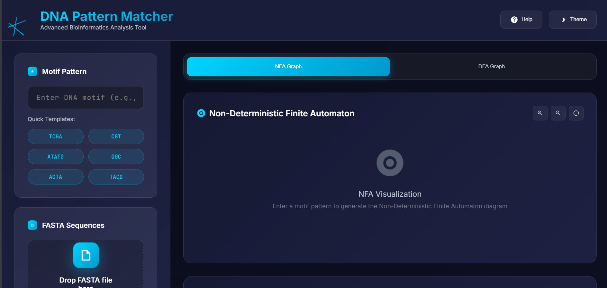
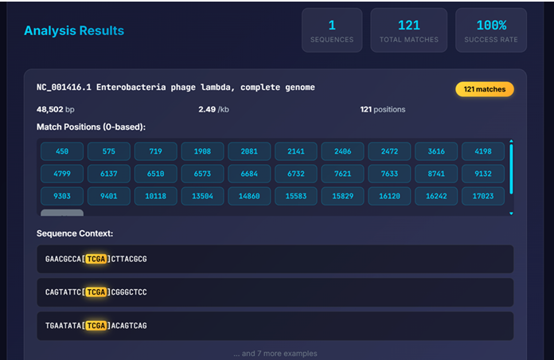
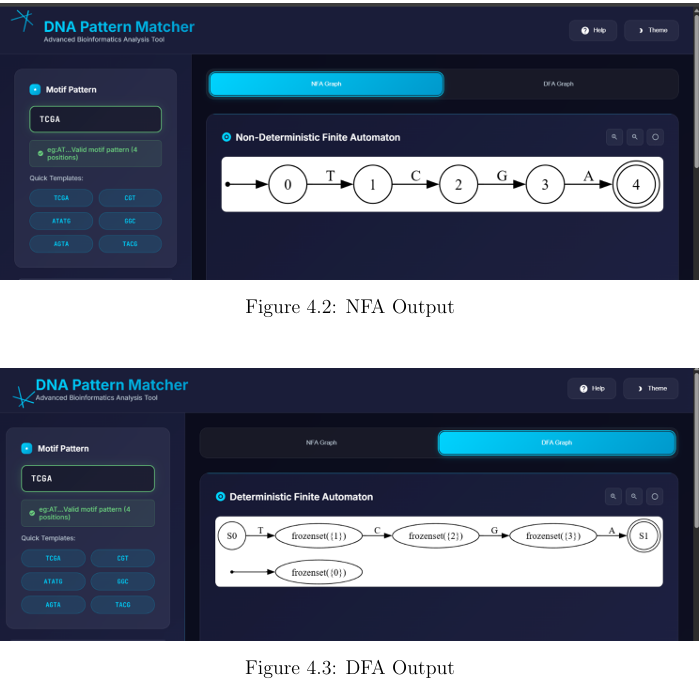

# DNA Pattern Matcher using Finite Automata

An interactive bioinformatics tool for detecting DNA motif patterns using
Non-Deterministic and Deterministic Finite Automata (NFA/DFA).

## 🔬 Project Overview
This project applies Formal Language and Automata Theory to efficiently
identify DNA motifs in biological sequences. Motifs are converted into NFAs,
transformed into DFAs using subset construction, and matched against FASTA
sequences.

## ⚙️ Features
- DNA motif parsing with IUPAC codes
- NFA construction and NFA → DFA conversion
- FASTA sequence analysis
- Exact motif position detection
- Interactive NFA and DFA visualization using Graphviz
- Web-based interface using Flask

## 🛠 Tech Stack
- Python
- Flask
- Finite Automata (NFA & DFA)
- Graphviz
- HTML, CSS, JavaScript
## Screenshots

### Homepage


### Motif Analysis


### Pattern Matching Output



## 📂 Project Report
The detailed academic project report is available here:  
📄 `report/Pattern_Matching_Finite_Automata_Report.pdf`

## ▶️ How to Run
```bash
pip install -r requirements.txt
python app.py
